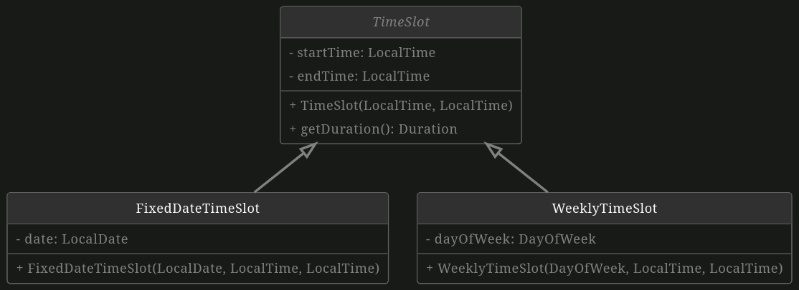
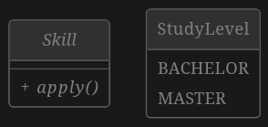
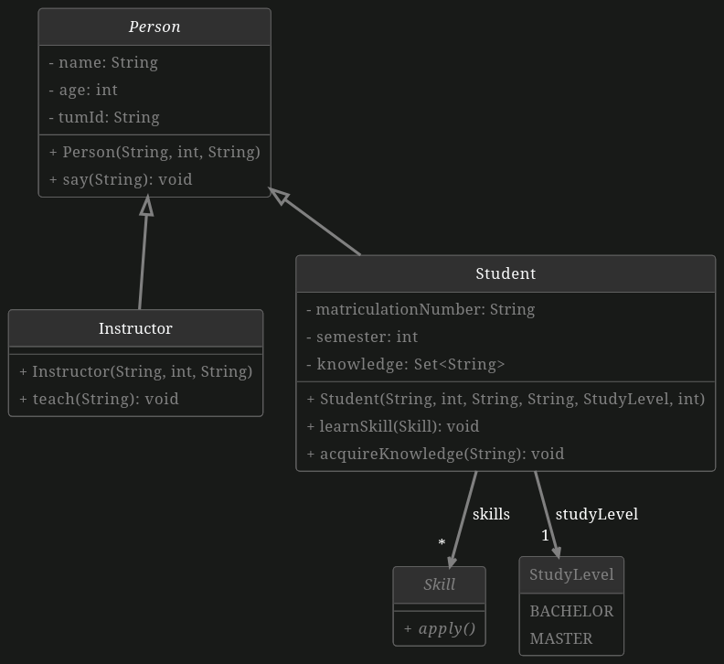
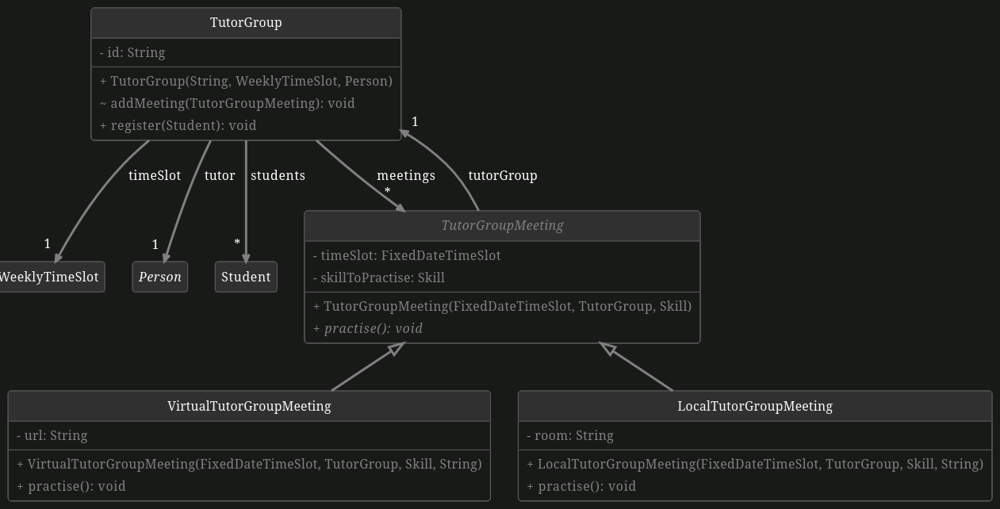

# Object Oriented Programming

In this exercise, we want to implement a university system with tutor groups and time slots for tutor groups, lectures, and possibly other events.

This exercise serves as a test for yourself to see if you have the necessary programming experience to participate in this course without struggling.

### General hints:
- All attributes should be `private`, except when noted otherwise.
- All attributes should have a public `getter`, except when noted otherwise.
- All the UML class diagrams below include types, visibility information, identifiers, and constructors, so they belong into the object design phase. Please make sure to follow the structure defined in the UML class diagrams.
- UML class diagrams typically do not contain constructors, however, in this exercise, they are provided as a means of help for you which constructors you should implement. Do not add any other constructors other than the ones shown in the UML class diagrams.
- More information on UML class diagrams on [UML Class Diagram Tutorial](https://www.visual-paradigm.com/guide/uml-unified-modeling-language/uml-class-diagram-tutorial).
- **~** in the UML diagram stands for package private.
- All files for Java classes have already been created in the exercise template. Adapt them as needed. Files for Enums have to be created manually. Make sure to use the correct name in the Java file.

## Part 1: Time Slots

To support tracking the lecture and tutor group times in the university system, we need to implement the following three classes using inheritance and abstraction. Implement the classes `TimeSlot`, `FixedDateTimeSlot` and `WeeklyTimeSlot`.

1. **Implement TimeSlot**

    A `TimeSlot` is just a time slot of a day with a start time and an end time. Use the classes `LocalTime` and `LocalDate` from the `java.time` package.

2. **Implement FixedDateTimeSlot**

    A `FixedDateTimeSlot` is a `TimeSlot` which has a fix date. It represents a time slot at that specific date.

3. **Implement WeeklyTimeSlot**

    A `WeeklyTimeSlot` is a `TimeSlot` which has a weekday. It represents a time slot that is repeatedly on that specific day of the week.
        

4. **Implement getDuration**

    For the implementation of `getDuration()`, take a look at the class `java.time.Duration` and its methods.

## Part 2: Skill and StudyLevel

The university system should also be able to track whether students fulfill the prerequisites. Therefore, we introduce the concepts of a skill and a study level. Create an interface `Skill` and an Enum `StudyLevel`.

1. **Create Skill**

    `Skill` represents a skill that can be learned by a `Student` and that a `Student` can apply (note the `Student` class is only introduced in the next part, you do not need it for this part). The `Skill` interface should have one abstract method `apply()`. This allows it to be used as a functional interface.

2. **Create StudyLevel**

    `StudyLevel` is the level of study, either bachelor or master.

## Part 3: Person, Student and Instructor

To model the course instructors and the tutor group participants (students), we introduce some more classes. Implement the classes `Person`, `Student`, and `Instructor`.

1. **Implement Person**
    Has `name`, `age`, and `tumId` for the purpose of the university system.

2. **Implement Student**
    
    A `Student` is a `Person` and has a matriculation number, a study level, a semester and sets of learned skills and acquired knowledge. A student does not know anything at the beginning and has no skills. Hint: make sure to initialize the sets.

3. **Implement Instructor**
    
    An `Instructor` is a `Person` and can `teach`.

We also want to implement some functionality for these classes:

1. **Let persons say something**

    Implement a method `say(String)` in `Person`, so that it prints (using `System.out.println`) the given String to the console in the following format: `said:` where `<name>` is the person's name and `<text>` the argument of the method. The method should not be able to be overwritten.

2. **Let instructors teach something**
    
    Implement a method `teach(String)` in `Instructor`, so that the Instructor then **says**: `Please learn ""` where `<lecture content>` is the argument of the method. Hint: The teach method must not contain `System.out.println`, it should instead use already implemented functionality.

3. **Let students acquire knowledge**

    Implement `acquireKnowledge(String)` so that the `String` containing the knowledge is added to the student's knowledge set.

4. **Let student learn skills**
        
    Implement `learnSkill(Skill)` so that the `Skill` is added to the student's skill set.

## Part 4: Tutor Groups

Now, the real challenge begins. We want to implement virtual and local tutor groups to support university courses and all-online courses such as EIST.

Implement the classes `TutorGroup`, `TutorGroupMeeting`, `VirtualTutorGroupMeeting`, and `LocalTutorGroupMeeting`.

1. **Implement TutorGroup**

    Has a set of students that participate. A `TutorGroup` has an id (e.g. fr03), a `WeeklyTimeSlot` for the normal meeting schedule, a tutor (who is a person) and a list of its meetings.

2. **Implement TutorGroupMeeting**

    A `TutorGroupMeeting` is associated with a tutor group and a skill that should be practised. Upon creation, a `TutorGroupMeeting` is given a `TutorGroup` that it belongs to. Make sure to let the `TutorGroup` itself know of that meeting as well. A `TutorGroupMeeting` can practise a skill, but how this is done depends on the type of meeting. Therefore, `practise()` is abstract.

3. **Implement VirtualTutorGroupMeeting**

    A `VirtualTutorGroupMeeting` is a `TutorGroupMeeting` and has a `URL`. Implement `practise()` as follows:

    - The tutor **says** `Thank you for joining using today`. where `<url>` is the virtual meeting's URL.
    - Every participating student learns the skill that should be practised in this `TutorGroupMeeting`.
    - The tutor **says** `See you next time!`.

4. **Implement LocalTutorGroupMeeting**

    A `LocalTutorGroupMeeting` is a `TutorGroupMeeting` and has a room. Implement `practise()` as follows:

    - The tutor **says** `Thank you for coming to today`. where `<room>` is the local meeting's room.
    - Every participating student learns the skill that should be practised in this `TutorGroupMeeting`.
    - The tutor **says** `See you next time!`.

## Part 5: Analyze Tutor Group Meetings

Instructors want to know different kinds of information about tutor group meetings. In this part, you will have to calculate this information using the [Java Stream API](https://docs.oracle.com/en/java/javase/17/docs/api/java.base/java/util/stream/Stream.html).

Implement the following Methods in the class `TutorGroupStatistics`.

1. **Implement averageDuration()**

    Given a Stream of TutorGroupMeetings, calculate the average duration of all meetings in seconds. Make sure to return the calculated value. Return the value 0 if the given stream is empty. Helpful Methods: [mapToLong()](https://docs.oracle.com/en/java/javase/17/docs/api/java.base/java/util/stream/Stream.html#mapToLong(java.util.function.ToLongFunction)), [average()](https://docs.oracle.com/en/java/javase/17/docs/api/java.base/java/util/stream/LongStream.html#average()).

2. **Implement repeatedSkills()**

    As we have identified in previous tasks, each `TutorGroupMeeting` contains exactly one `Skill` that should be practised during the meeting. However, sometimes students ask the tutor to repeat information from previous meetings, which leads to them learning a previously learned skill again. This means that a Stream of `TutorGroupMeetings` can contain the same skill multiple times. In this task, you will receive a Stream of `TutorGroupMeetings`, with which you should calculate the Set of all repeated skills.

    Hint: You can achieve this by first [mapping](https://docs.oracle.com/en/java/javase/17/docs/api/java.base/java/util/stream/Stream.html#map(java.util.function.Function)) the given values into a List of Skills. Then, you can use the method [Collections.frequency()](https://docs.oracle.com/en/java/javase/17/docs/api/java.base/java/util/Collections.html#frequency(java.util.Collection,java.lang.Object)) to determine how often a skill is present inside this list.