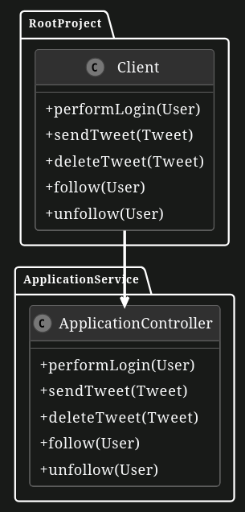
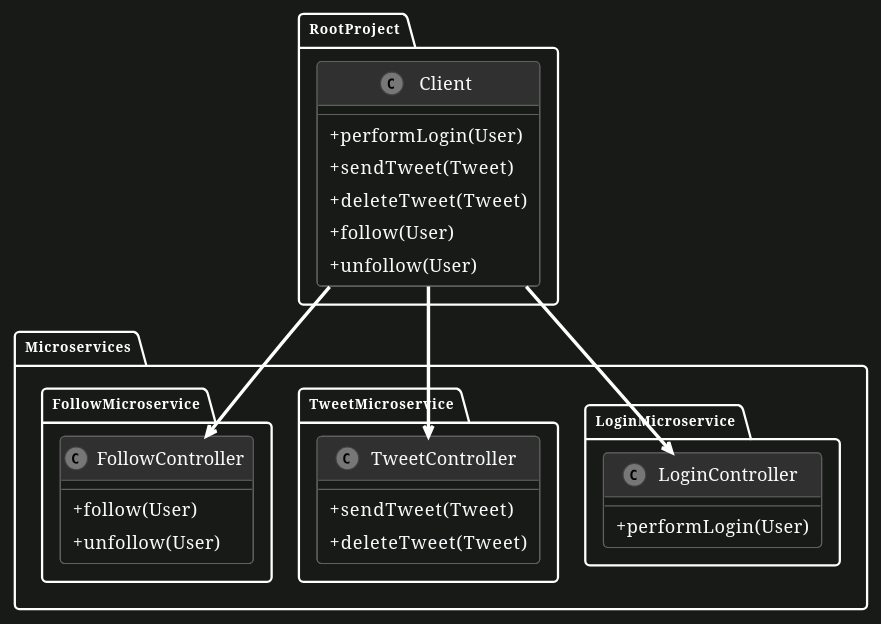

# Strangler Pattern

In this exercise, you will use the Strangler Pattern to refactor a monolith to microservices.

# TUM Social App

A few TUM students created a social networking app similar to Twitter for use within their student group. When the app gained some popularity, they noticed its structure was inefficient. With help from EIST students, they planned to change their single, large application into a set of smaller, interconnected services, known as microservices. The app's current setup can be seen in the UML diagram below. Right now, all the functions for logging in, posting messages, and following others are grouped into a single component named `ApplicationService`. This means every request from users is directed to this one component which cause load/balance and maintance issues. Therefore, it is decided that to apply a **strangler pattern**.

In the implementation of strangler pattern, the old system is put behind an intermediary facade. Then, while application is still running, the services within the old system are restructured into a fresh set of services. When a new service becomes fully functional, the intermediary facade is adjusted to redirect requests that were previously directed to the old system's service towards the new service. Check the UML Diagram below and investigate the functionality that the application has.

The methods have mock method bodies with the purpose of learning the concepts of the strangler pattern.

## UML Diagram of the Monolith Application

After looking over the diagram, the students created a new layout for the app using microservices, which you can see in the UML diagram below. To apply strangler pattern, the `ApplicationService` is renamed as `LoginMicroservice`. However, it still has all the other methods related to the tweeting and following functionalities that must be structured into new microservices.

Before beginning the separate to microservices, it’s important to review the `Client` and `LoginController` classes. These classes are essential for understanding how the app processes requests and how different parts of the app communicate with each other. They added two new parts called `TweetMicroservice` and `FollowMicroservice`. The goal now is to make sure that the right operations go to the right microservices. This means each request from a user will go directly to the microservice that’s set up to handle it.

To make the app work better in the future, it’s important to organize these operations properly. This organization helps keep the app easy to manage and ready to grow. Before you start on the tasks, make sure to look at all the microservices and their controller classes in your project. Understanding where each part is and what it does is essential to making the app work well.

## UML Diagram of the Microservice Application

**After initial understanding and preparation you have the following tasks:**

1. **Migrate functionality to Microservices**

    Now we want to move methods to their responsible microservice. `TweetMicroservice` is responsible for `sendTweet()` and `deleteTweet()` operations. Remove those methods from `LoginController` and locate them in `TweetController`. Similarly, `FollowMicroservice` is responsible for `follow()` and `unfollow()` operations. Remove those methods from `LoginController` and put them in `FollowController`.

    **Note:**
    Do not change the methods' bodies. Be sure that you preserve mapping types, values, and the method bodies while moving methods to their related endpoint so that they can still get API calls correctly. Also, be aware that in a real world example, Controller classes act like a router class, where it gets the request and direct request body to a service method which perform operations on the data to handle data persistancy with a Database connection shared across related microservices. For example, for our little application, we can assume that LoginMicroservice is connected to a separate database which handles sensitive data such as credentials, whereas Tweet and Follow microservices are connected to the shared database to handle delivering your Tweets to your followers and viewing the Tweets belong to the ones you followed.

2. **Forward call to the right service**
    
    As a second step, now calls coming from the client should be directed to the correct microservice. Right now, the client routes all calls to `LoginMicroservice` end point in all methods. The other endpoints are already given in the `Client`. Change URLs with correct microservice’s URL to provide correct routing in `sendTweet()`, `deleteTweet()`, `follow()`, and `unfollow()` in Client to their responsible Microservice instead of `LoginMicroservice`.