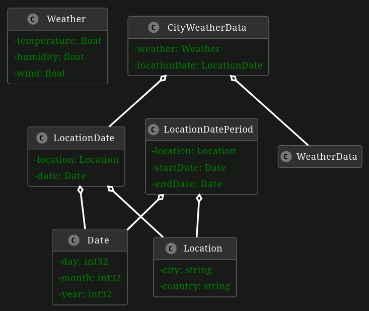

# gRPC Weather Reporter

The aim of this exercise is to develop your practical understanding of gRPC.

Please first read through [this basic Java gRPC Tutorial](https://grpc.io/docs/languages/java/basics/).

The following sections in the above tutorial are not relevant for passing all the tests in this exercise:

- Client-side streaming RPC
- Bidirectional streaming RPC
- Creating the client

In this exercise, we want to implement a client called `User` which requests for weather data and a server called `WeatherReporter` which delivers weather data.

## Part 1: Create Proto File

First, we need to implement the following relevant data types in the proto file

The `Client` can send 2 types of requests:

1. **Simple RPC**

    Client can request for a single location the weather data for a single day. Server responds with the weather data for that location for that single day Implement in the proto file `GetCityWeatherSingleDay()` which takes in a `LocationDate` and returns a single `CityWeatherData`

2. **Server Side Streaming RPC** 

    Client request for a single location the weather data for **a range of days**. Server responds with a **stream** of weather data for that particular location for the specified **range of days inclusively**. Implement in the proto file `GetCityWeatherMultipleDays()` which takes in a `LocationDatePeriod` and returns a stream of `CityWeatherData`

3. Generate the classes using the proto file you have created.

    1. Execute the Gradle "generateProto" task (Go to Gradle tab in IDE and press "Tasks > other > generateProto").
    2. The generated classes from the proto file should be in build/generated/source/proto/main folder.

## Part 2: Implement the WeatherReporterService inner class

The `WeatherReporterServer` class is used to host our Grpc WeatherReporter Service and can be started using the `main()` method. As the build task only generates an abstract class for the WeatherReporterService we now need a concrete implementation where we define the rpc methods. Therefore, now implement the methods `GetCityWeatherSingleDay()` and `GetCityWeatherMultipleDays()` in the inner class `WeatherReporterService` as described in Part 1.

Note: WeatherReporterGrpc.WeatherReporterImplBase should already be generated from the proto file and should be in **de.tum.in.ase.eist.grpc**

## Part 3: (Optional) Implement the WeatherClient

Now that we have a functional RpcG Server that runs the WeatherReporterService we can call the rpc methods from a client. A basic version of such a client is implemented in the `WeatherClient` class. The only thing missing are the implementations for the `getCityWeatherSingleData()` and `getCityWeatherMultipleDays()` methods.

Your implementation of the client will not be tested and is solely for you to be able to test out your server. For testing you can add Weather data to the Server via its `main()` function.