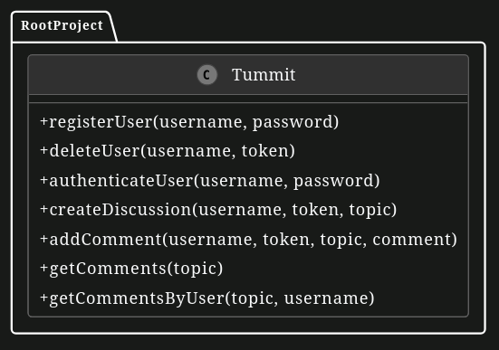
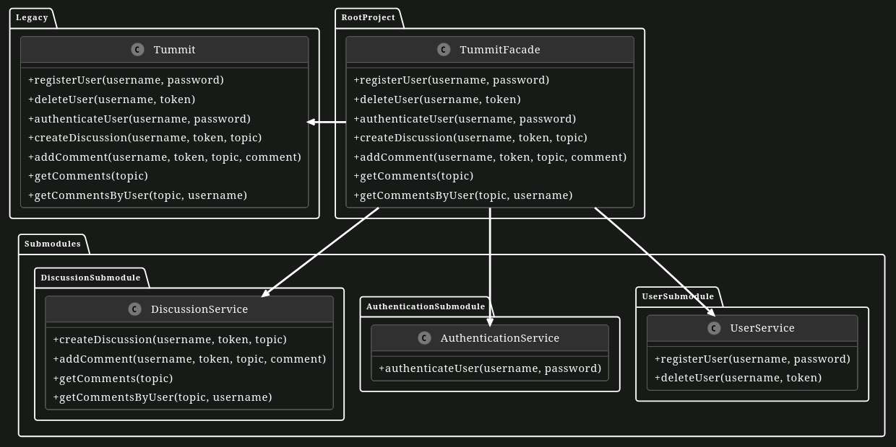

# Strangler Pattern

In this exercise, you will use the Strangler Pattern to refactor a simple monolith to microservices.

# Tummit Discussion Board

A few TUM studetns created a social discussion board app similar to Reddit for use within their student group. At first, the structure was not that important and for the sake of fast delivery, they developed a monolith project which contains all the functionality. However, as the things become more mature, they want to divide the monolith application into separate modules.

However, to ensure not to miss any functionality, they decided to use the **Strangler Pattern** to gradually move away from the monolithic structure. In the implementation of Strangler Pattern, the old system is put behind an intermediary facade. Then, while application is still running, the services within the old system are restructured into a fresh set of services. When a new service becomes fully functional, the intermediary facade is adjusted to redirect requests that were previously directed to the old system's service towards the new service.

Check the UML Diagram below and investigate the functionality that application has. The methods have mock method bodies with the purpose of learning the concepts of the strangler pattern.

## UML Diagram of the Monolith Application

After looking over the diagram, the students created a new layout for the app using submodules, which you can see in the UML diagram below. To apply strangler pattern, the `Tummit` class is put behind a `TummitFacade` class. Furthermore, they configured the facade class to call the monolith app if the requested module is not available. Before beginning the separate to submodules, it’s important to review the `TummitFacade` and `Tummit` classes. These classes are essential for understanding how the app processes requests and how different parts of the app communicate with each other. The students added three new parts called `UserService`, `AuthenticationService` and `DiscussionService`.

The goal now is to make sure that all the operations in the legacy app are implemented in the right submodules with correct behavior. This means each request from a user will go directly to the submodule that’s set up to handle it (this part is done by the `TummitFacade` class). To make the app work better in the future, it’s important to organize these operations properly. This organization helps keep the app easy to manage and ready to grow.

Before you start on the tasks, make sure to look at all the submodules in your project. Understanding where each part is and what it does is essential to making the app work correctly. The students have also created a demo app (`Main` Class) to test out their integration as they progress.

## UML Diagram of the Submodules

**After initial understanding and preparation you have the following tasks:**

1. **Migrate functionality of user related operations to UserService**

    We'll start by moving the `registerUser()` and `deleteUser()` methods from the `Tummit` monolith to the `UserService` microservice. Make sure to adapt the `deleteUser()` method to use the other microservices. While the `UserService` microservice won't have a direct access to the `userTokens` (as in the monolith implementation), the class has a reference to the `AuthenticationService` which exposes equivalent methods. Similarly, the `DiscussionService` can be used for deleting the comments posted by the users.

2. **Migrate functionality of authentication related operations to AuthenticationService**

    Next let's move the `authenticateUser()` method from the `Tummit` monolith to the `AuthenticationService`. Similarly to the previous task, the `AuthenticationService` won't have direct access to the list of `users` and it must use the referenced `UserService`.

3. **Migrate functionality of discussion related operations to DiscussionService**
    
    To complete the migration, we'll move the last methods (`createDiscussion()`, `addComment()`, `getComments()`, `getCommentsByUser()`) from the `Tummit` monolith to the `DiscussionService`. As before, make use of the `AuthenticationService` to ensure that an user is authenticated without directly accessing the `userTokens`.

    While migrating any functionality, always ensure that the behavior from the legacy app is reflected exactly.