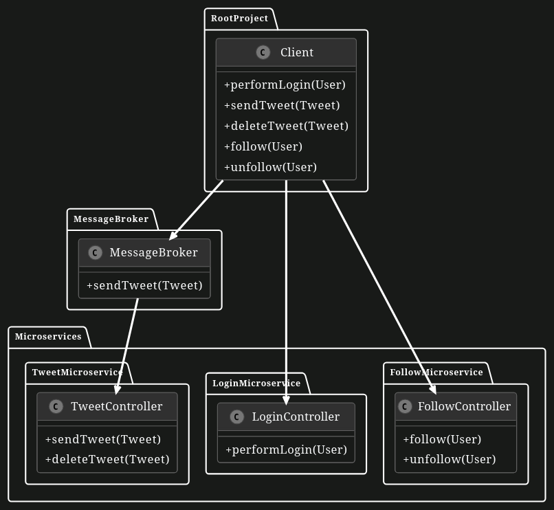
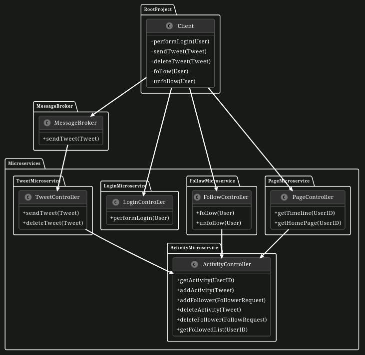

# Microservices Architecture

In this exercise, you will implement new microservices which will add even more functionality into TUM Social App. The exercise can be solved without solving other exercises. You are only expected the solve following tasks to implement Activity and Page Microservices. The other microservices are given implemented and can be used in main method to perform your own tests. **Choose Gradle while initializing the project.**

## UML Diagram of the Microservice Application with the MessageBroker

In order not to have too complicated task, developers decided to add only two more essential microservices: Page microservice for timeline and homepage features and Activity Microservice for getting the Activity of the users inside the application. Implement the microservice controllers.

## UML Diagram of the Microservice Application with Message Broker and with the Additional Microservices

TODO: **After initial understanding and preparation you have the following tasks:**

**Part 1: Implement the Activity Microservice Methods:**

Implement the following tasks to complete Activity Microservice. Understand the functionality of the methods and decide the correct mappings type as Post, Get and Delete mappings.

1. **Create addActivity in ActivityMicroservice**
    
    Implement the function `addActivity` to add the corresponding Tweet to the user activity. The method should have the `/addActivity` endpoint. It adds a new `Tweet` as an activity for the `User` by extracting the user id from the tweet, creating a list for the user if it doesn't exist, and adding the tweet to the user's list of activities (called `userActivityMap`).

2. **Create getActivity in ActivityMicroservice**

    Finish the `getActivity` method to extract the activities of a `User`. The method should have the `/getActivity/{id}` endpoint. The id from the endpoint will be parsed as a path variable to a parameter called `userID`. Inside the method, we will be using the `userActivityMap` to retrieve the list of activities of the user identified by the given userID. If the user has no activities, an empty list will be returned.

3. **Create addFollower in ActivityMicroservice**

    The `addFollower` method adds a new follower to a user. It should have the `/addFollower` endpoint. It extracts information about the follower and the followed users from the request, creates a list for the follower if it doesn't exist, and adds the followed user to the list of followed users of the follower. Make use the `userFollowedMap` field to implement these operations.

4. **Create getFollowedList in ActivityMicroservice**

    To get the Followers, use the `getFollowedList` method. It should have the `/getFollowedList/{id}` endpoint. This method uses the `userFollowedMap` to get the list of followed users or returns an empty list if the user is not following anyone.

5. **Create deleteActivity in ActivityMicroservice**
    
    To delete a certain `Tweet` from the Activities, we will need to implement the `deleteActivity` method. It should have the `/deleteActivity` endpoint. It deletes a specific tweet from a user by determining the user from the tweet and removing the tweet from the user's list of activities stored as part of `userActivityMap`. Make sure that you keep the other tweets belonging to that user.

6. **Create deleteFollower in ActivityMicroservice**

    To delete a certain `Follower` from the Activities, we will need to implement the `deleteFollower` method. It should have the `/deleteFollower` endpoint. It extracts the follower and the followed users and removes the followed user from the list of users followed by the follower (stored via the `userFollowedMap` field).

    Hint: Be aware that the Tweet and User objects might be different between microservices. Therefore, the best way to remove them from a list is looking for their IDs. Avoid using list.remove(object).

**Part 2: Implement the Page Microservice Methods:**

Implement the following tasks to complete Page Microservice. Understand the functionality of the methods and decide the correct mappings type as Post, Get and Delete mappings. When using `RestTemplate` objects, please keep in mind that our tests have a few limitations by design and you can call either of the following methods:

- `RestTemplate.getForObject`
- `RestTemplate.exchange` with no request entity (the parameter can be set as `null`)

1. **Create getTimeline in PageMicroservice**

    Implement the function `getTimeLine` to retrieve the timeline (list of tweets) for a specific user. It should have the `/getTimeLine/{id}` endpoint. It sets the content type for the request headers, sends a request to the `getActivityURL` to fetch the user's activities using the `RestTemplate` and returns the list of tweets from the response.

2. **Create getHomePage in PageMicroservice**
    
    Implement the `getHomePage` method to retrieve the home page consisting of the tweets from the users we are following. It should have the `/getHomePage/{id}` endpoint. It sets the content type for the request headers, sends a request to the `getFollowedListURL` to get the list of users that the specified user is following and retrieves the list of followed users from the response. Then it itereates through the followed users, fetching the timeline for each user using `getTimeLine`, appends the tweets from each user's timeline to the home page list and returns the aggregated home page list.

Additional Notes: Feel free to add any necessary checks, validations, or additional logic as you see fit