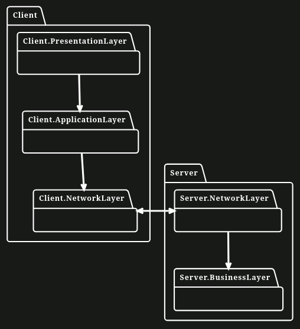
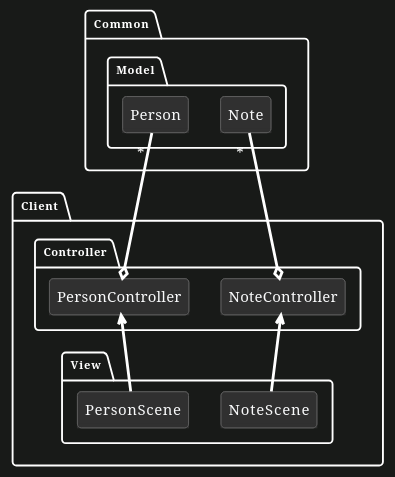
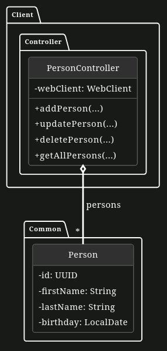

# REST Architectural Style

The university has finally decided to use real-world examples for learning purposes as opposed to mystical penguins. However, the previous developers were not happy with that decision and waddled off having deleted parts of the project they didn't like. The Project is a simple [REST API](https://www.geeksforgeeks.org/rest-api-introduction/) based on `Spring Boot`. Your task is to apply the layered architectural pattern on top of an MVC design pattern and to **write an API**.

This exercise uses [Spring Web](https://www.tutorialspoint.com/spring/spring_web_mvc_framework.htm) on the server side to process and reply to REST requests that the client-side sends using [Spring WebFlux](https://howtodoinjava.com/spring-webflux/spring-webflux-tutorial/). The provided links provide a preview of how the frameworks work. It isn't necessary to know in detail the workings of the framework but it's worth a go.

## Application Structure

The following model describes the `Layered Architecture` that is used for this exercise to separate the implemented functionality into different layers.

### Client-Side:  
- The `Presentation Layer` contains functionality that the user directly interacts with (such as a GUI).
- The `Application Layer` contains the actual application logic. This layer receives the entities (Person and Note) from the `Network Layer`, processes it and passes the data over to the `Presentation Layer`. In addition, this layer receives events from the `Presentation Layer` (such as invoking updating the name of an entity) and forwards the events in terms of method calls to the `Network Layer`.
- The `Network Layer` contains the functionality to send REST requests to the server.

### Server-Side:
- The `Network Layer` contains the functionality to receive, validate and respond to REST requests from the client.
- The `Business Layer` contains the functionality to process the entities received from the client. In this exercise, this layer is also responsible for persisting (saving, updating and deleting) the entities.

## Layered Architecture

On the client side, the `Model View Controller Pattern` has been applied. The following component model describes the implementation in detail.

## MVC Component Diagram

**_Note: Important! To run the application try it locally, please run `H05E01ServerApplication` for the server side and `Starter` for the client side. Do not run H05E01ClientApplication!_**

## Application Functionality

This system has 2 sides.
- **Client-side**
- **Server-side**

The server side has an open endpoint listening on port `8080` for HTTP Requests. For every respective HTTP Request, a specific action is carried out to fulfil the task and return the result. The client-side has a JavaFX GUI, to spare the clients the rather scary-looking naked REST Calls and have it run behind closed doors instead. For every respective action, it generates the required HTTP Request and sends it to the server and gets back an HTTP response which is then used to update the UI.

The endpoints you'll have to implement should allow you to **Create, Read, Update and Delete (CRUD)** persons. In detail, these are:

- `POST /persons`: Creates a new person. The person is passed via the body of the HTTP request. The response contains the saved person in the body of the HTTP response
- `GET /persons`: Reads all persons. The persons are returned as a list in the body of the HTTP response
- `PUT /persons/{personId}`: Updates the person with the given ID. The updated person is passed via the body of the HTTP request. The response contains the updated person in the body of the HTTP response
- `DELETE /persons/{personId}`: Deletes the person with the given ID. It returns an HTTP `204 No Content` response if successful

_Note: There are TODOs in the code giving helpful hints_

**Side note**: If you want to try out these new REST Requests directly without the client, run the server side by running H05E01ServerApplication, and use the following curl commands to see REST in action.
`curl -X GET -H "Content-Type: application/json" "localhost:8080/notes?secret=SecretKey"` should return `[]` as nothing has been stored.
`curl -X POST -H "Content-Type: application/json" -d '{"name":"nice","content":"this is how you save a nice note","creationDate":"2001-06-09T04:20:21.91119Z"}' "localhost:8080/notes"` to save a nice note. It'll return the saved data as json to acknowledge what was saved
`curl -X GET -H "Content-Type: application/json" "localhost:8080/notes?secret=SecretKey"` would then return the same note.
Note: The creationDate gets overwritten as that is generated by the server. You can cross-check if the data got saved by running `Starter` and then checking out `Notes`

### Part 1 

In the first part, we want to get basic functionality up and running on the server side. Specify the endpoints in the server in `PersonResource`. You have to forward each action to the `PersonService` and add any additional checks before that.

1. **Endpoint to create a person**

    Implement the method `createPerson`, which saves a valid `Person`. You need to ensure that it is indeed a new Person that does not have an ID yet.

2. **Endpoint to update a person**

    Implement the method `updatePerson`, which updates a valid `Person` based on the UUID. You need to ensure that the modified Person has personId as its ID.

3. **Endpoint to delete a person**

    Implement the method `deletePerson`, which deletes a `Person` based on the UUID.

4. **Endpoint to get all persons**
    Last but not the least, implement the method `getAllPersons`, which returns all persons.

_Note: Feel free to get inspired by `NoteResource` for additional help._

### Part 2

In the second part, we will now be writing the RESTFUL Requests to the server on the client side. But first, we need to set up `PersonController` properly according to this UML Diagram. The Controller should work like this:

- There is a single `WebClient` instance that is used for all requests
- Each method should only send a single HTTP request
- The HTTP requests need to happen asynchronously
- It has an internal list of all persons
    - If a person is created, updated or deleted this has to be updated in the list
    - If all persons are retrieved from the server the list has to be updated accordingly
- Each method takes a `Consumer<List<Note>>` parameter, which has to be called after a response is received
    - This consumer takes the internal list of persons as a parameter

## UML Diagram

1. **Request to create a person**

    Implement the method `addPerson` which sends a POST Request to our server to add a `Person`.

2. **Request to update a person**

    Implement the method `updatePerson` which sends a PUT Request to our server to change the attributes of the old `Person` according to the UUID.

3. **Request to delete a person**

    Implement the method `deletePerson` which sends a DELETE Request to our server to delete a `Person` based on the UUID.

4. **Request to get all persons**
    Last but not the least, implement the method `getAllPersons` which sends a GET Request to our server to get a list of `Person` objects.

_Note: Don't forget the constructor of `PersonController`_

### Part 3

It has been determined that the server should now also support the sorting of persons. The functionality for this has already been implemented in the client UI. The user can sort the persons by their ID, first name, last name, and birthday in either ascending or descending order. These options are stored in `PersonSortingOptions` for convenience.

It is now your job to implement this feature. The sorting itself should happen in the `PersonService`. The `GET /persons` endpoint has to be adapted to accept the sorting options and pass them to the `PersonService`. The client request also has to be adapted to send the sorting options to the server. Some additional notes:

- The sorting options have to be passed as the query parameters `sortField` and `sortingOrder`. You can look at the `GET /notes` endpoint to see an example using query parameters.
- The server endpoint should still work without specified sorting options. In this case, it should default to `ID` and `ASCENDING` as the sorting options. Hint: Look at the JavaDoc of `RequestParam`.

1. Add the sorting functionality

Implement the method `getAllPersons` in `PersonService` which sorts the list of `Person` according to the `PersonSortingOptions` parameter. Then update the `getAllPersons` methods in `PersonResource` and `PersonController` to pass the `PersonSortingOptions` in the HTTP request.

_Note: Do not change the attributes of PersonService, this will lead to Artemis tests failing_