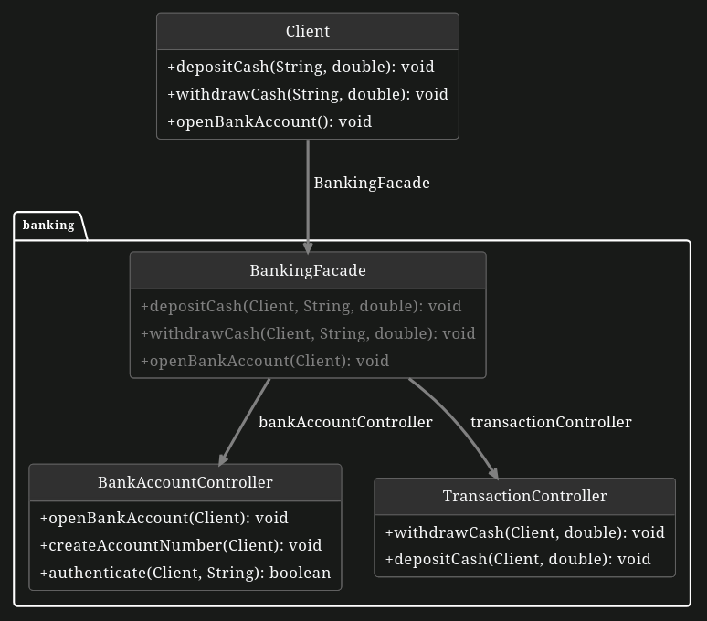

# Façade Pattern

The façade Pattern is a design pattern used to simplify complex subsystems by providing a unified and simplified interface to clients.

## Problem Statement

The banking system has many different parts that do different jobs. But to make it easier for people and smoother behind the scenes, we should put all these parts together in one simple interface. This is where the façade pattern comes in – it helps combine everything into a single, easy-to-use system for a better banking experience.

Our task here is to design a bank management system which includes subsystems such as account management and transaction handling. A facade pattern needs to be applied to make these interactions between clients and these subsystems simpler.

The client provides their name and the beginning balance to open a bank account. After that, each client is assigned a unique bank account number and a PIN code.

For putting in or taking out money, here's how it works:

1. The client enters their bank account number to **identify** their account.
2. The client enters their PIN code for **authentication**.
3. The client specifies the amount of money they want to **deposit/withdraw**.
4. The banking system performs a series of **validations**, including verification of **the correctness of the PIN code**, confirmation of **sufficient funds** for a withdrawal, and validation of **non-negativity of the transaction amount**. Upon successful completion of these checks, the system proceeds with the transaction and updates the account of the respective individual.

This exercise is a simplified version, and we acknowledge that lots of potential issues are not addressed, such as our bank system doesn't have enough money to complete the withdrawal process. There would be further features in the real world.

**You have the following tasks:**

Currently, clients can access functionalities they should not be able to access. Furthermore, some clients are overwhelmed with the controller system. Your task is to resolve this issue by refactoring Phuong's code and introducing the façade pattern. Implement the facade according to the UML diagram below that Phuong has prepared for you.

## 1. Implement the Facade

1. **Add public methods to the facade**

    Implement all the public methods from the classes TransactionController and BankAccountController in class BankingFacade, excluding the authenticate method from BankAccountController. The logic for the authenticate method is already implemented in the withdraw and deposit methods in class Client, reuse that logic for class BankingFacade. Make sure that each controller is initialized in the constructor.

## 2. Reduce the coupling

1. **Remove associations to the controller classes and add associations to the facade**

    Remove the associations between Client and the two controllers: BankAccountController and TransactionController. Add associations to the BankingFacade in the class Client and implement the functionality in these classes by invoking methods on the BankingFacade.

## UML Diagram

- Maybe you don't know ¯_( ͡• ‿‿ ͡•)_/¯: A façade (/fəˈsɑːd/) is generally the front part or exterior of a building. It is a loanword from the French façade (pronounced [fasad]), which means "frontage" or "face".
