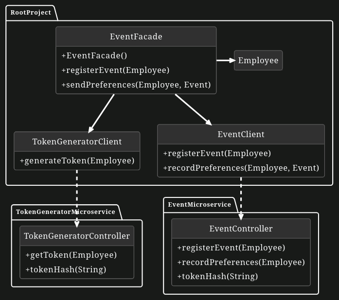
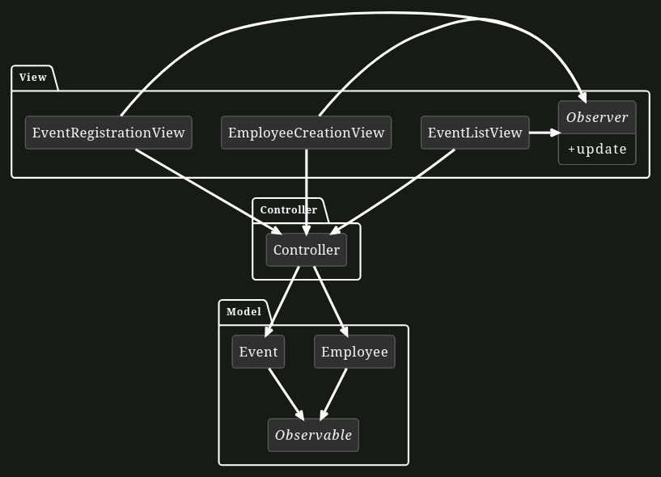

# Event Registration Application

## Problem Statement

Your company is planning a private dinner for its managers. To manage the registration and attendee preferences, they require an application. Since it's a private dinner, only managers should be able to register. Given the sensitivity of their company passwords, a separate token generation mechanism should be implemented for identity verification. Additionally, you are tasked with creating a user interface for these operations. This project is divided into two main components: the Facade with Access Policy and the Model-View-Controller. Each comes with its UML Diagrams and task descriptions.

# Facade with Access Policy

## Problem Statement of Facade Pattern

`Important! This task can be solved individually from the MVC Pattern part!`

This task emphasizes the creation of a token generation system utilizing the Facade Pattern. The goal is to prototype a capability system that manages token generation, event registration, and back-end preference storage. Note that the token hashing mechanism and the clients for microservice communication are already in place. Your role involves implementing the Facade Pattern and basic operations within the microservices to achieve the specified tasks.

## UML Diagram of the Facade part with Access Policy

## Part 1: EventFacade

First, you need to implement EventFacade.

**You have the following tasks:**

1. **Implement Register Event**

    You need to finish the implementation of the `registerEvent` method in the `EventFacade` class. First, it must be ensured that only managers can register events. If the employee is NOT a manager, the system should display a console message stating `Only managers can register the event!`. If the employee is identified as a manager, they must have a valid token to register for the event, which can be generated using the `generateToken` method in `TokenGeneratorClient`. Once the token has been successfully generated, it should be assigned to that particular manager's token instance. Following the successful generation of a manager's token, the `registerEvent` method from the `eventClient` should be employed to register that manager. If the system confirms the registration with a `Registration is successful` message, then the manager's `isRegistered` status should be updated to `true`. If the registration does not go through, a `Registration failed` message should be printed to the console.

## Part 2: EventMicroservice

Second, you need to implement `registerEvent` in the `EventController`.

**You have the following tasks:**

1. **Implement Register Event**

    Your task is to finish the `registerEvent` endpoint. The method should use the `tokenHash` method of the same class to produce a token specific to the employee. Once generated, compare this locally-created token (derived from the employee's name and ID) with the token instance associated with the employee to verify its validity. If the tokens match, indicating authenticity, proceed to add the employee to the `registeredList` and return `Registration is successful`. However, if the tokens don't align, refrain from adding the employee to the list and instead return the message, `Registration failed`.

# Model-View-Controller

## Problem Statement of Model View Controller Pattern

**Important! This task can be solved individually from the Facade Pattern part! You have to change only code in the Client package.**

In this task we focus on creating a User Interface using the MVC pattern. We want to create a simple prototype of a GUI to register events and assign employees to these events. Furthermore, the functionality to create and list events in the UI is already implemented. In this task you have to implement the functionality of creating employees and assigning them to an event.

## UML Diagram of the Model-View-Controller Part

## Architecture:

- Model: Employee and Event
- View:
    - EventListView: Homescreen in which all events are listed
    - EventRegistrationView: Popup in which you can create a new Event or update an existing one
    - EmployeeCreationView: Popup Window to create and assign Employees to an Event
- Controller: Controller: Makes sure to notify the corresponding Views when the Model is changed

You can make yourself familiar with the existing UI by starting the `main`-method in `ClientMain`. As you can see the event registration process works but it is not possible yet to add employees to an event.

## Part 1: Controller

**You have the following task:**

1. **Implement addNewEmployee(Employee employee)**

    Implement the `addNewEmployee` method in the `Controller` class. Add the passed employee parameter to the `EventRegistrationView`, then notify the employee's observers.

## Part 2: View

**You have the following tasks:**

1. **Implement save()**

    Implement the `save` method in the `EmployeeCreationView` which is called when clicking on the 'Save Changes' button. Update the name of the `employee` model with the value from the `employeeNameTextField` and use the `controller` to add the `employee` instance.

Now you should be able to create new Employees and notice these changes in the `EventRegistrationView`.