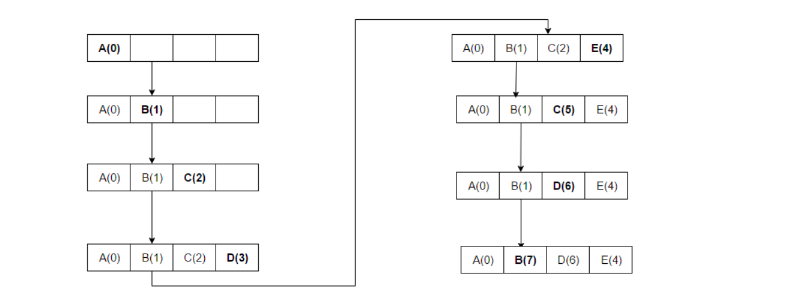

# Key-Value (KV) Store with Caching policies

[Caching](https://en.wikipedia.org/wiki/Cache_(computing)) is an important concept in computer engineering used to improve performance by storing previously computed results, thereby avoiding redundant computations. Since a cache typically has limited memory and cannot hold all possible data, it may become full. Therefore, a caching policy or replacement algorithm is required to determine which entries should be removed when the cache reaches its capacity.

In this exercise, we want to implement a simple [Key-Value (KV) store](https://en.wikipedia.org/wiki/Key%E2%80%93value_database) that stores a key-value pair in a database. We want to use caching to avoid calls to the database whenever possible since they are expensive (e.g. communication-[overhead](https://en.wikipedia.org/wiki/Overhead_(computing))). So, instead of fetching data from a database each time, we retrieve them from the local cache if possible. You will implement 5 different caching policies for our cache: **first in first out (FIFO), least frequently used (LFU), most frequently used (MFU), least recently used (LRU), and most recently used (MRU)**.

For the best experience, make sure to have [Python](https://www.python.org/downloads/) installed. You will also need the pickleDB Python framework which can be installed by running `pip install pickledb`. Additionally, you still need to implement some functionalities in both the `KVCachingStore` and `Cache` classes.

**IMPORTANT:** If you intend to test the implementation locally, please remove the dot in the second line: **from .Cache import Cache** of `KVCachingStore.py`. Please remember to add it back before pushing it to Artemis! Otherwise, the unit tests won't be executed.

You can find an example implementation of **MOST RECENTLY USED CACHE POLICY (MRU)** in `Cache.py`. You can analogize this example to other different caching policies.

The individual boxes represent the storage of our cache. The letters are the Keys with their respective counter value we store in the cache. The counter value reflects in the case of MRU the access time. So a value of 0 means that it was accessed at time 0. So for example **A(0)** is an element with key A and the counter 0.

**Step 1-4:** We add elements to the cache with the respective counter values.

**Step 5:** Our cache is now full and we want to allocate space for E(4). We are using the MRU. D(3) has the highest counter because it was the last recently used, so it has to be removed from the stack

**If you want to know more details about this topic, you can check the following link:** [Cache replacement policies](https://en.wikipedia.org/wiki/Cache_replacement_policies#:~:text=queue%2Dbased%20policies-,First%20in%20first%20out%20(FIFO),times%20they%20were%20accessed%20before)

## Part 1: Get element from KV-store

First, we need to implement the get method of the KV-store. You can find the relevant code in `KVCachingStore.py`.

**You have the following tasks:**

1. **Implement Get Method in KVStore**
    
    Implement the method `get(self, key)` in the class `KVCachingStore`. Make sure to follow the 4 stepped to-do's inside of the class.

## Part 2: Caching policies

We want the cache to manage different caching policies for storing the data. Therefore, you will implement all of the 3 methods inside the Cache; get, put, and evict in a way that they can handle all of the caching policies we have. The cache is presented as an "`OrderedDict`" in the Python code which stores key-value pairs.

**You have the following tasks:**

1. **FIFO**
    
    It works on the principle that the first items entered or added are the first ones to be evicted or processed. Implement the `put(self, key, value)`, `get(self, key)`, `modify_counter(self, key)`, and `evict(self)` methods in the class `Cache` to handle FIFO caching mechanism.

**Hint:** If implemented correctly, it should be sufficient to modify only the `modify_counter(self, key)` and `evict(self)` methods in the upcoming tasks. If the MRU tests already pass, that's a good sign your implementation is on the right track.

1. **LRU**

    It works on the principle that the least recently accessed items are the ones evicted first when the cache is full and requires space for new items. Modify the `modify_counter(self, key)` and `evict(self)` methods in the class `Cache` to support LRU caching mechanism.

2. **MRU**
    
    It works on the principle that when the cache is full, the algorithm identifies and evicts the most recently accessed item in a cache. Modify the `modify_counter(self, key)` and `evict(self)` methods in the class `Cache` to support MRU caching mechanism.

**Hint:** The counter for LRU and MRU policies is incremented at every step.

1. **LFU** 

    It works on the principle that when the cache is full, the algorithm identifies and evicts the element that has been accessed the fewest times. If multiple elements share the same minimum counter value, the algorithm prioritizes evicting the element that was added to the cache earliest. Modify the `modify_counter(self, key)` and `evict(self)` methods in the class Cache to support LFU caching mechanism.

2. **MFU** 

    It works on the principle that when the cache is full, the algorithm identifies and evicts the item that has been accessed the most times. If multiple elements share the same maximum counter value, the algorithm prioritizes evicting the element that was added to the cache earliest. Modify the `modify_counter(self, key)` and `evict(self)` methods in the class `Cache` to support MFU caching mechanism.

**Hint:** Counters for each element in LFU and MFU policies are only incremented when the element is used (get or put).

**Note: Use the `KVStore.py` file to test your implementation locally!**