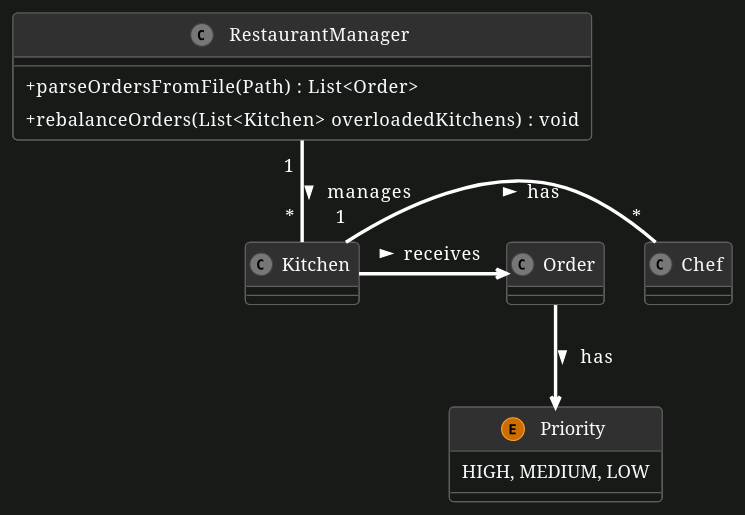

# Scalable Kitchen Simulation

**Background**:

A Software Engineer named Aniruddh thought of opening a new restaurant called FoodPalace and manage it with the skills he learned in the EIST Course. You are tasked to help him by building a Restaurant Order Management System. There are multiple `Kitchen`s that receive orders from the `RestaurantManager` Aniruddh. Notably, kitchens do not have a maximum order capacity. Instead, managing the distribution of these orders efficiently is the job of the restaurant manager.

Here is a basic UML diagram that displays the relationship between the different classes (but does not contain all methods and attributes).

**Implementation Details**:

Sections/methods you need to implement are marked with TODO comments. Note that this also means we won't list every single method, that you have to implement, here in the problem statement. The detailed requirements and specifications for each of these methods can be found in the docstring comments above each method. Ensure you read them carefully.

**Tasks**:

1. **Implement a ReadWriteLock**

    Implement a `ReadWriteLock` from scratch. As indicated in the comments, you can find the methods you have to implement in the `LoggingReadWriteLock` class. As noted in the comment above the class, this implementation does not have to be "fair". This lock will be used to manage access to shared data structures in your system.

    Important Notes: When using the `ReadWriteLock` class elsewhere in the system, make sure to only use the `lockWrite` function when mutating/writing, and use the `lockRead` function when reading (i.e. not mutating/writing). Furthermore, ensure that the critical regions, which are the code regions enclosed by a lock() and unlock() function, are minimal/as small as possible. With minimal we mean both in terms of the number of code lines and the sleeping duration of threads (you can, for instance, take a look at `Order.process()`, which sleeps for a while, so calling this inside a critical region would not be ideal, if it's not necessary). Note that these hints are not just recommended, but will be enforced in the tests.

1. **Kitchen Chefs**

    Several chefs work in each kitchen. We model each of these chefs as a thread. Each chef has access to the order queue of the kitchen. Therefore, make the `Chef` class runnable by implementing the `run` method, which should continuously process orders from the order queue, and take a short break once all existing orders have been processed. Importantly, the order queue may also be accessed by Aniruddh which are on different threads, so make sure to use the ReadWriteLock as a synchronization primitive for order queue accesses.

    **Hint**: Note that only operations/function calls performed on the order queue have to be made thread-safe through synchronization. Operations called on the order object itself should not be enclosed by mutexes. This is because only the order queue is the resource shared across multiple threads. By synchonizing access to the shared order queue, we ensure that no two threads access the same order at a time. This implies that e.g. `order.process()` should not be enclosed in a critical region.

1. **Kitchen Management**

    Each kitchen maintains its own queue of orders. Implement methods that allow orders to be assigned to this kitchen and extracted (needed later for rebalancing) from this kitchen, as well as a method to get the current order count. There are two important things to note here: Firstly, 'extracting' an order means completely removing it from the queue. Secondly, we have already learned that chefs, which run on different threads, may also access the orders at the same time. Therefore, make sure to use synchronization primitives here. Lastly, the orders are not supposed to be processed in the order of their arrival, but according to their priority. An order with a higher priority should be processed before orders with lower priorities. We already use the `PriorityQueue` class for the queue, which automatically keeps the list in a sorted state according to Java's [Comparable](https://docs.oracle.com/en/java/javase/17/docs/api/java.base/java/lang/Comparable.html) interface (which we have also already implemented for you).

2. **Restaurant Manager Aniruddh**

    Sometimes a kitchen might be overloaded because it cannot process orders quickly enough. Our system should prevent/mitigate such overloading by periodically checking if "rebalancing" is necessary. The periodical checks try to find overloaded kitchens, and then rebalance the orders (see how an overloaded kitchen is defined in the docstring comment above the method). Rebalancing means redistributing the orders from overloaded kitchens to other kitchens. The algorithm you should implement for this rebalacing is described in the docstring comment above the method, and boils down to: If there is at least one kitchen that is not overloaded, extract one order from each overloaded kitchen and add it to a non-overloaded kitchen.

3. **Parsing the Orders from a File**

    Finally, Aniruddh has a file-based system in place to receive orders. Each line in the file contains one order, and each order is formatted as "ID,ProcessingDuration,Priority". This ressembles the csv format. See the `orders_requests.csv` file for an example. Please implement the method `parseOrdersFromFile`.