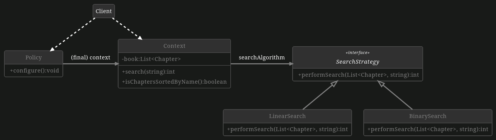

# Searching with the Strategy Pattern

The Strategy Pattern is a behavioral design pattern that allows choosing different strategies based on a policy during runtime.

You are a working student for the startup e-BOOKist. Due to the observed user behavior of often not reading the whole book but rather only reading the most intriguing chapters, it is important to choose the most suitable search algorithm when searching for the page number of a chapter. It is your responsibility to solve this task. The only constraint you get is that you should use the Strategy pattern to choose between Linear Search and Binary Search.

## Your Tasks

## Task 1: Searching

First, you need to implement two search algorithms, in this case, `LinearSearch` and `BinarySearch`.

1. **Implement Linear Search**

    Implement the method `performSearch(List<Chapter>, String)` in the class `LinearSearch` using Linear Search. Linear search simply means iterating through the list until the object you are looking for is found. If the chapter name is found in the book, the `pageNumber` should be returned, otherwise, the return value should be `-1`. You should create a submethod called `linearSearch(List<Chapter>, String)` where the linear search is performed.

2. **Implement Binary Search**

    Implement the method `performSearch(List<Chapter>, String)` in the class `BinarySearch` using Binary Search. If the chapter name is found in the book, the `pageNumber` should be returned, otherwise, the return value should be `-1`. [Here](https://www.tutorialspoint.com/data_structures_algorithms/binary_search_algorithm.htm) you can find an explanation of Binary Search. You should create a submethod called `binarySearch(List<Chapter>, String)` where the binary search is performed.

## Task 2: Strategy Pattern

We want the application to apply different search algorithms for chapter names in our e-book to retrieve the corresponding page numbers. Use the strategy pattern to select the appropriate search algorithm at runtime.

1. **SearchStrategy Interface**

    Create a `SearchStrategy` interface and adjust the search algorithms so that they implement this interface.

2. **Context Class**

    Create and implement a `Context` class following the class diagram below. Make sure to add getters and setters for all attributes.

    1. **Implement isChaptersSortedByName**

        Implement the helper method that determines if the e-book's chapters are sorted by name or not. Return `true` if chapters are sorted by name, otherwise `false`. This method should later be used to determine which search algorithm is used. Do not traverse the chapter list more than once and do not modify it.

    2. **Implement search**
        Implement the `search` method according to the class diagram below. The method should execute the search in the book based on the `searchAlgorithm`.

3. **Context Policy** 

    Create and implement a `Policy` class following the class diagram below with a simple configuration mechanism. Make sure to add a constructor that takes a `Context` object as a parameter. The following two tasks should be implemented in the `configure` method.

    1. **Select Linear Search**

        Select `LinearSearch` when chapters are not sorted by name because `BinarySearch` requires a sorted list and sorting is additional overhead.

    2. **Select Binary Search**
        
        Select `BinarySearch` when chapters are already sorted by name because then `BinarySearch` is more efficient and applicable.

4. Complete the `Client` class which demonstrates switching between two strategies at runtime. This class is not tested.

