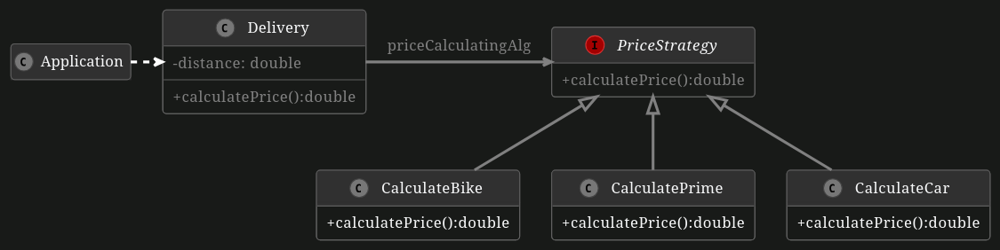

# "TUMber Eats" with the Strategy Pattern

You are now contributing to TUMber Eats. You are required to implement price-calculating algorithms for deliveries, which can have different distances and can be ordered by normal or VIP customers. In this exercise, you will not only implement the algorithms to calculate the price of a delivery but also choose the suitable algorithm to use based on specific runtime variables.

## Part 1: Strategy Pattern

The application should apply different price-calculating algorithms for each delivery. Use the strategy pattern to select the most suitable algorithm at runtime.

**You have the following tasks:**

1. **PriceStrategy interface**

    Adapt the modifier of `PriceStrategy` and declare the method price calculate method following the class diagram below.

2. **Adapt the existing price calculations** 

    Make the existing price calculations implement the `PriceStrategy` on the `CalculateBike`, `CalculatePrime` and `CalculateCar` classes.

3. **Adapt the Delivery class** 
    
    Add a PriceStrategy attribute in the `Delivery` class. Also, implement the methods `getPriceCalculatingAlg()`, `setPriceCalculatingAlg()` and `calculatePrice()`.

## Part 2: Calculating

In this second part of the exercise, you should implement the algorithm for calculating the price in the class "CalculateCar". The price should be computed as: Price = 3.2 + distance / 2.6.

**You have the following tasks:**

1. **Implement CalculateCar**

    Implement the method `calculatePrice(double distance)` in the class `CalculateCar`. Make sure to follow the formula above exactly. Check if the value for the distance is valid. (Hint: Check the implementation in the other price calculations classes)

