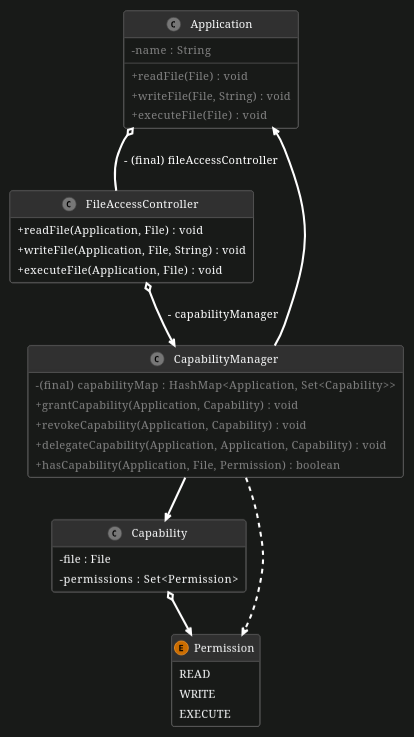

# Applying Capability-Based Access Control

Capability-Based Access Control (CBAC) is a fundamental security model used within cloud environments. Unlike Access Control Lists (ACLs), which primarily define access rights based on users and roles, CBAC focuses on managing capabilities that specify particular permissions for resources, such as files. With a CBAC security model, applications are granted specific capabilities, allowing them to perform actions irrespective of the resources. This means that an application with a given capability can interact with any resource it is authorized to without needing separate permissions for each resource. Thus, CBAC is especially suitable for the large and dynamic cloud environments due to its scalability and adaptability concerning managing fluctuating access rights.

In this exercise, we aim to implement capability-based file access control for a cloud-based file sharing service. `Applications` can be granted, revoked, or delegated `Capabilities` by a `CapabilityManager`. These capabilities define the `Permissions` to read, write, and execute files within the application. Whenever an application attempts to perform certain actions, the `FileAccessController` checks if the application possesses the required capabilities and acts accordingly.

## Part 1: Application Capabilities

First, we go to the class 'Application' that implements the capabilities of the 'fileAccessController' to read, write, and execute files. All methods may throw a `SecurityException`.

**You have the following tasks:**

1. **Implement Application class**

    Go to empty class `Application` and add its variables `name` and `fileAccessController` according to the UML diagram below. Make sure to initialize all variables in the constructor.

2. **Read Files** 

    Introduce the method `readFile(File)`, that calls the corresponding method of the `FileAccessController` with the required parameters. Please keep in mind that the method may throw a `SecurityException`, however exception handling is not required, as already done in the `FileAccessController` class.

3. **Write Files**

    Introduce the method `writeFile(File, String)`, that calls the corresponding method of the `FileAccessController` with the required parameters. Other than in the `readFile(File)` method, `writeFile(File, String)` also takes a parameter of type `String` for the content. Please keep in mind that the method may also throw a `SecurityException`, however exception handling is not required, as already done in the `FileAccessController` class.

4. **Execute Files**

    Introduce the method `executeFile(File)`, that calls the corresponding method of the `FileAccessController` with the required parameters. Please keep in mind that the method may also throw a `SecurityException`, however exception handling is not required, as already done in the `FileAccessController` class.

## Part 2: Implement CapabilityManager

Next, we want to enable the `CapabilityManager` to be able to check if capabilities exist for an application and be able to manage them.

**You have the following tasks:**

1. **Add capabilityMap**

    Add a new variable `capabilityMap` as depicted in the UML diagram. Don't forget to initialize the variable in the constructor.

2. **Check Permissions** 

    Adjust the method `hasCapability(Application, File, Permission)`, which is supposed to check if a requested capability exists in the `capabilityMap`. A capability is the `permission` of an `application` for a certain `file`. **Hint:** Check the `Capability` class for useful methods.

3. **Manage Capabilities**

    In order to manage permissions, the `CapabilityManager` must be enabled to grant new capabilities, revoke existing permissions, as well as delegate permissions from one application to another.

4. **Grant Capability**

    Adjust the implementation of the method `grantCapability(Application, Capability)` so that it adds a capability of an application to the `capabilityMap` if it does not exist yet.

5. **Revoke Capability** 

    Adjust the implementation of the method `revokeCapability(Application, Capability)`, that it removes a capability of an application of the `capabilityMap`, if it exists.

6. **Delegate Capability**

    Adjust the implementation of the method `delegateCapability(Application, Application, Capability)`, that it revokes a certain capability from the "old" application and grants it for the "new" application.

**Hint:** Have a look at the Java `File` [documentation](https://docs.oracle.com/javase/8/docs/api/java/io/File.html).