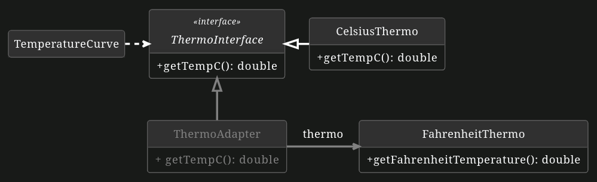

# Adapter Pattern

One of your fellow students stepped on the Celsius thermometer at TUM, and it broke. Luckily, you just learned about the adapter pattern and know that the Fahrenheit thermometer is still intact. Therefore, you want to use your newly acquired knowledge to help your colleague out and get the Celsius display working again.

**You have the following tasks:**

1. **Create the class ThermoAdapter that implements ThermoInterface**

    Make sure to add `ThermoAdapter` in the same package

2. **Add an association to FahrenheitThermo in ThermoAdapter** 

    Name the attribute `thermo` and make sure to instantiate it

3. **Implement the method in ThermoAdapter** 

    Delegate the method call to the `FahrenheitThermo` attribute `thermo` and convert the return value using the formula `(tempF - 32.0) * 5.0 / 9.0`

4. **Use ThermoAdapter to display the current temperature**

    Replace the implementation of `CelsiusThermo` in `TemperatureCurve` with `ThermoAdapter`.

