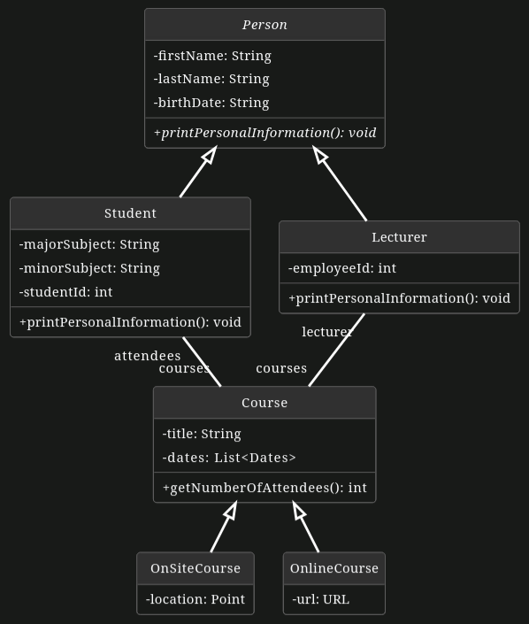

# Unit Tests

In this exercise, we want to implement four unit tests for the University App using `JUnit5`.

Import the project as a `Gradle` project in your IDE.

In case you experience problems or you have compilation errors, make sure you have installed the Java 17 JDK and use it both for compilation and execution.

**Important:**

- Please name the test methods **exactly as specified in the text below!** Otherwise, the automated correction of your solution will fail and you might not get full points.
- You can find the test cases in the test folder. You only need to edit source code in that folder. Annotate each test with `@Test`. Do not change the code in the src folder!
- Run your tests locally before you submit your changes (i.e. commit and push them). Only submit your changes, if your tests pass locally.

**You have the following tasks:**

1. **Test getTitle method**

    `getTitle()` in `Course` returns the title of the course object.

    - Add a new test case `testGetCourseTitle()` in `CourseTest` that instantiates a `Course` object with a title and checks if `getTitle()` returns the Course's title correctly.

2. **Test getNumberOfAttendees method**

    `getNumberOfAttendees()` in Course returns the number of attendees of the course.

    - Add a new test case `testNoAttendees()` in `CourseTest`. It should check if `getNumberOfAttendees()` returns `0` if there are no attendees.
    - Add a new test case `testThreeAttendees()` in `CourseTest`. It should check if `getNumberOfAttendees()` returns `3` if there are three attendees.

    
3. **Test setOnlineCourseUrl method**

    `setOnlineCourseUrl(String)` in `OnlineCourse` updates the course URL with a given string. It will throw a `MalformedURLException` if the URL is not valid.

    - Add a new test case `testSetOnlineCourseUrlWithValidUrl()` in `OnlineCourseTest`. It should set a valid URL using `setUrl()` and afterwards check if `getUrl()` returns the correct URL object.
    - Add a new test case `testSetOnlineCourseUrlWithInvalidUrl()` in `OnlineCourseTest`. It should set an invalid URL using `setUrl()` and test if the `MalformedURLException` is thrown.

Below you can find a UML class diagram that shows the structure of the source code you have to test. It omits getters, setters, and constructors for simplicity reasons.

**Hint**: Take a look at the slides from Lecture 06 to see how you can run JUnit tests.