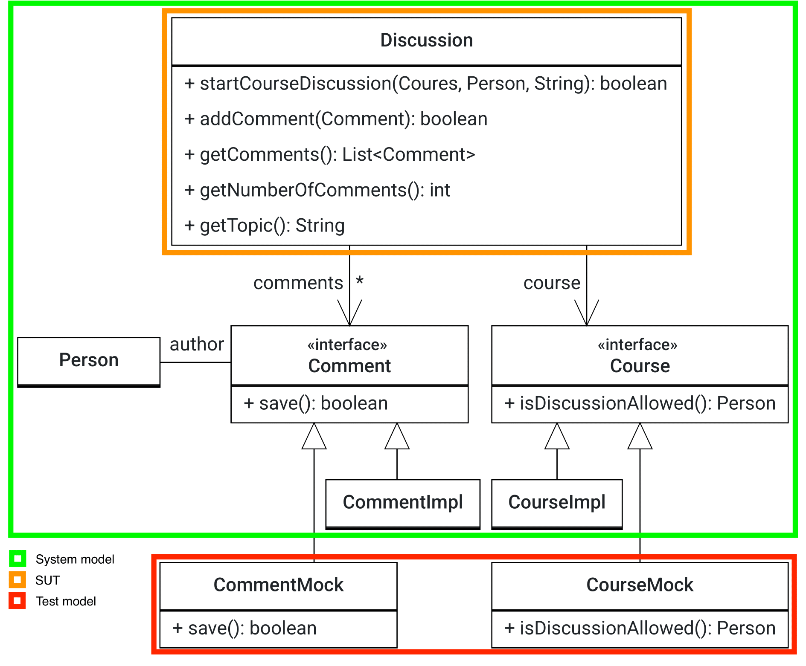

# Mock Object Pattern

The EIST team wants to implement their own discussion forum. As they follow an agile way of working, they want to write unit tests during development to ensure good coding standards. As the development of the discussion forum is not finished yet, some objects in the system model are not yet implemented and need to be mocked.
In this exercise, we want to write three unit tests to verify an existing system model.
The following UML diagram shows the system model (green), the SUT (orange), and the test model (red):

Write unit tests for the `Discussion` class (SUT). The methods in `Discussion` use methods of other classes (collaborating objects) such as `Comment` and `Course`, which are not yet implemented and need to be mocked. This means, that in the system model, there are already interfaces for `Comment` and `Course`, however, the actual implementations `CommentImpl` and `CourseImpl` are missing. We use the Java testing framework `EasyMock` to mock these objects. With `EasyMock`, we do not need to create mock classes, we can simply specify the behaviour of collaborating objects by using their interfaces (in this case `Comment` and `Course`) in the test case.

Import the project into your IDE. In case you experience problems, make sure you have installed the Java JDK 17.

**Important:**

- Please name the test methods **exactly as specified in the text below!** Otherwise, the automated assessment of your solution will fail and you might not get full points.
- You can find the test cases in the `test` folder. Annotate tests with `@Test`. You only need to add and change source code here. Do not change code in the `src` folder!
- Run your tests locally before submitting your changes (i.e. before you commit and push them). Only submit your changes if your tests pass locally.
- To verify that your test cases are implemented properly, our test system additionally injects a wrong Discussion class, i.e., a wrong SUT. In this case, your test cases must fail, otherwise, your test case is not complete.
- You can simulate this failure verification if you change the implementation of the corresponding method in `Discussion`, e.g., to an empty method body.
- It is helpful to provide appropriate error messages in assertions.
- Don't forget to use verify() with Mock Object.

**You have the following tasks:**

1. **Set up the DiscussionTest class**

    Add a new attribute `discussion` of type `Discussion` and annotate it as test subject (SUT). Add two more attributes: `courseMock` of type `Course` and `commentMock` of type `Comment` and annotate them as well.

2. **Test addComment**

    Write a test method named `testComment()` in `DiscussionTest`:

    - Have a look at the source code of `addComment()`: It invokes the `save()` method of `Comment`, which is not implemented yet.
    - As we want to test the `Discussion` class independently of the `Comment` implementation, we need to mock the `Comment` class.
    - Mock the method `save()` of `Comment`, so that it always returns true, i.e. the saving worked.
    - Test if the `addComment()` method works as specified and if the return value of `getNumberOfComments()` correctly increases after `addComment()` was invoked.

3. **Write another test for addComment**

    Write a test method named `testCommentIfSavingFails()` in `DiscussionTest`. Check that if saving a comment fails, `addComment()` also works as specified and the number of comments does not increase.

4. **Test startCourseDiscussion**

    Write a test method named `testStartCourseDiscussion()` in `DiscussionTest`:

    - The `startCourseDiscussion()` method checks if a person is allowed to start a discussion by invoking the `isDiscussionAllowed()` method of `Course`. We want you to test this method independently from the permission check.
    - Create a `Person` instance (either `Student` or `Lecturer`) and mock the course, such that the person may start a discussion.
    - Test if the `startCourseDiscussion()` method is working as specified and if the method sets the course and the topic of the `Discussion` object properly.
