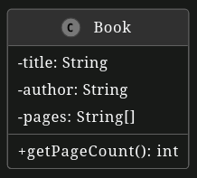

# Unit Tests

In this exercise, we want to implement four unit tests for the University App using `JUnit5`.

Import the project as a `Gradle` project in your IDE.

In case you experience problems or you have compilation errors, make sure you have installed the Java 17 JDK and use it both for compilation and execution.

**Important:**

- Please name the test methods **exactly as specified in the text below!** Otherwise, the automated correction of your solution will fail and you might not get full points.
- You can find the test cases in the test folder. You only need to edit source code in that folder. Annotate each test with `@Test`. Do not change the code in the src folder!
- Run your tests locally before you submit your changes (i.e. commit and push them). Only submit your changes, if your tests pass locally.

**You have the following tasks:**

1. **Test getTitle method**

    `getTitle()` in `Book` returns the title of the book object.

    - Add a new test case `testGetTitle()` in `BookTest` that instantiates a `Book` object with a title, author and pages and checks if `getTitle()` returns the Book's title correctly.

2. Test getAuthor method

    `getAuthor()` in `Book` returns the author of the book object.

    - Add a new test case `testGetAuthor()` in `BookTest` that instantiates a Book object with a title, author and pages and checks if `getAuthor()` returns the Book's author correctly.

3. Test getPageCount method

    `getPageCount()` in `Book` returns the number of pages in the book.

    - Add a new test case `testNoPages()` in `BookTest`. It should instantiate a `Book` object with a title, author and an empty array and check if `getPageCount()` returns `0` if there are no pages.
    - Add a new test case `testThreePages()` in `BookTest`. It should instantiate a `Book` object with a title, author and 3 suitable pages and check if `getPageCount()` returns `3` if there are three pages.

Below you can find a UML class diagram that shows the structure of the source code you have to test. It omits getters, setters, and constructors for simplicity reasons.

**Hint:** Take a look at the slides from Lecture 06 to see how you can run JUnit tests.
