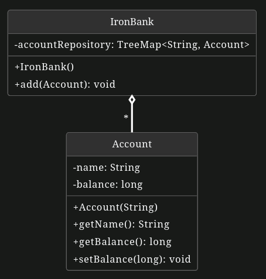
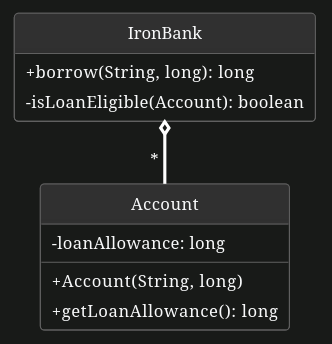
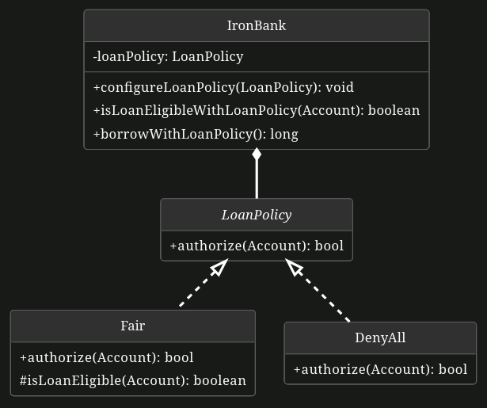
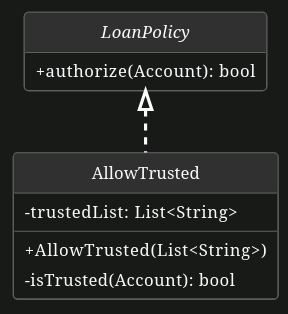
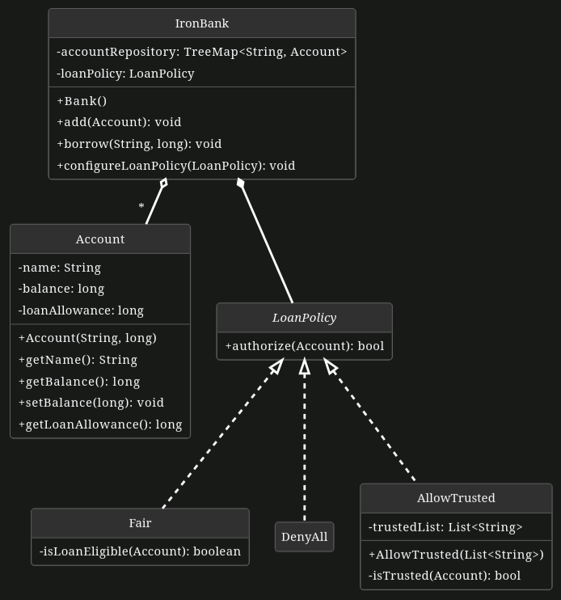

# The Iron Bank of Braavos

_You are a ~~loan-shark~~ respectable banker from the Iron Bank of Braavos. It's been brought to your attention that the situation with loans in Westeros has lately grown to be hugely complex and, as a result, utterly mismanaged by the Iron Bank. In order to bring back structure to the matter (along with some missing gold coins); you take on the prototyping of a new digital accounting system, to supersede the traditional and antiquated paper ledgers._

**Development Process: Tests First!**

As with the design of any other critical application, you proceed with care. You`ve decided to follow a **Test-Driven Development (TDD)** approach, where you always start by **writing test cases before any implementation code**. This method ensures proper functionality of the overall application, throughout the different stages of development.

**Important Note!**

**Test & Implementation independence:** Your test cases and implementation are graded individually. If you encounter any obstacles or find yourself stuck at any point, simply continue with the next questions. Both the test cases and implementation can be written independently.

**Code Structure:** The grading tests assume and rely on the original names of Classes, Attributes or Methods; as they can be found in the task template or task description. Please strictly refrain from changing or using different names or method prototypes from the ones already defined.

## Chapter 1: Setting-up the Bank

In this part, you first finish the implementation of a simple and generic banking system, composed of two classes: `Account` and `IronBank`.

**Below is the class diagram of the target application you should end up with at the end of this chapter.**

**<ins>Note:</ins>** Due to time constraints, we have provided the Account class for you. This allows you to focus on other parts of the task without having to implement this class from scratch.



**Q1)** Complete the `TestAccount` class, to test the following methods of the `Account` class.

- [SkipThis, Not Graded] **~~Implement testGetName()~~**: Assert that the `Account.getName()` method returns the name of the account's holder.
- **Implement testBalanceZero():** Assert that the `Account.getBalance()` method returns the proper initial value of the `balance` attribute.
- **Implement testBalanceNonZero():** Assert that the `Account.getBalance()` method returns the current value of `balance` (after its initial value has been changed).

**Q2)** Complete the `TestIronBank` class, to test the following methods of the `IronBank` class.

**<ins>Note:</ins>** You can use the provided `size()` and `contains()` methods of `IronBank` as helpers for your test assertions.

- [SkipThis, Not Graded] **~~Implement testBankEmpty()~~**: Assert that the `IronBank` instance is created empty.
- **Implement testAddAbsent():** Assert that the `add(Account)` method pushes an `Account` instance inside the bank when absent from the bank.
- **Implement testAddPresent():** Assert that the `add(Account)` method throws an `Exception` when trying to push an `Account` that is already present in the bank.

**Q3)** Complete the `IronBank` class, to finish the implementation of the following methods:

- **Add the constructor:** `IronBank` has only one constructor: `IronBank()`. It initializes the `accountRepository` attribute to a new, emtpy `TreeMap`.
- **Implement add(Account):** Inserts the supplied `Account` in the `accountRepository` map, and throws an `Exception` if already present.

## Chapter 2: Implement Loans

In this part, you extend `Account` and `IronBank` classes to implement the loan functionality.

**Below are the increments made over the previous part, represented in a class diagram.**



**Q4)** Loan Allowance

**4.1) Tests:**

- **Implement testIsLoanEligible()** in `TestIronBank`:

    Assert that isLoanEligible(Account) returns true when balance+loanAllowance>0.

- **Implement testIsNotLoanEligible()** in `TestIronBank`:
    
    Assert that isLoanEligible(Account) returns false when balance+loanAllowance<=0.

**4.2) Implementations:**

- **Add a new `long loanAllowance` instance attribute** in `Account`, with the corresponding getter.
- **Add a new Account(String, long) constructor** in `Account`, that takes two parameters: `String for the account name` and `long for the loan allowance`.
- **Implement getLoanAllowance()** in `Account`: Returns the `loanAllowance` attribute.
- **Implement isLoanEligible()** in `IronBank`: Returns `true` only when `balance + loanAllowance > 0`.

**Q5)** Contract Loan

**5.1) Write full unit testing coverage for borrow()** in `TestIronBank`:

**<ins>Note:</ins>** You can refer to the test decision table below that summarizes all test cases to be implemented.

This is the critical functionality of your bank, you must make sure that the algorithm is correct and perfectly implemented. To this end, you implement all test cases that cover all possible state combinations.

That is, `borrow()`: - Only succeeds if and only if the target Account exists in the bank AND is loan eligible; otherwise throws the matching `Exceptions`. - Returns the proper borrowed amount, which is the minimum between the requested amount (2nd parameter of `borrow()`) and the account’s maximum allowed debt (maxDebt = balance + loanAllowance).

**5.2) Implement borrow(String, long)** method in `IronBank`:

If the target `Account` is present in the `accountRepository` and is loan-eligible, this method should `decrease its balance` by the proper amount (as defined above) and `return the amount of gold coins borrowed`.

```
TestCase 1 = testBorrowNotInIronBank()

TestCase 2 = testBorrowNotLoanEligible()

TestCase 3 = testBorrowProperAmount()

TestCase 4 = testBorrowProperAmountLessThanAmount()
```

| **Test Case #**                          |**1**|**2**|**3**|**4**|
|------------------------------------------|-----|-----|-----|-----|
| **Pre-condition**                        |     |     |     |     |
| account is **present**                   | F   | T   | T   | T   |
| account is **loan eligible**             |     | F   | T   | T   |
| `requestAmount ≥ balance + loanAllowance`|     |     | F   | T   |
|                                          |     |     |     |     |
| **Post-condition**                       |     |     |     |     |
| `balance' := balance - requestedAmount`  |     |     | T   |     |
| `balance' := -loanAllowance`             |     |     |     | T   |
|                                          |     |     |     |     |
| **Exception**                            |     |     |     |     |
| `Exception` raised                       | Yes | Yes | No  | No  |
|                                          |     |     |     |     |
| **Effect**                               |     |     |     |     |
| Loan **accepted**                        | F   | F   | T   | T   |
| `return value := borrowedAmount`         |     |     | T   | T   |
|                                          |     |     |     |     |
| **Class Invariant**                      |     |     |     |     |
| `balance + loanAllowance ≥ 0`            |     | T   | T   | T   |

## Chapter 3: Freeze Loans in Westeros

_Lately, the Iron Throne has had exceptional outstanding debts, but stopped paying back. In response, the secret council of the Iron Bank decided to freeze any new loans in Westeros. This measure will pressure the Lords and Family of Westeros against the Iron Throne, in turn forcing them to pay back their debts._

You decide to implement a policy service in your `IronBank`, to enable changing dynamically the algorithm that authorizes loans - so as to follow the political biais of the bank council.

**Below are the increments made over the previous part, to implement this new Strategy pattern.**



**Q6)** Strategy `Fair` & `DenyAll`:

**6.1) Tests:**

- Copy the necessary test cases from `TestIronBank` class into two new classes: `TestLoanPolicyDeny` and `TestLoanPolicyFair`.
- In the `setup()` method of each new test class, configure your `IronBank` instance to use the appropriate loan policy (`DenyAll` for `TestLoanPolicyDeny`, `Fair` for `TestLoanPolicyFair`).
- Update the assertions in all test cases to match the behavior of the selected loan policy.
    - For `TestLoanPolicyDeny`, all loans should always be denied.
    - For `TestLoanPolicyFair`, loans should be granted or denied based on the account’s balance and loan allowance, exactly following the algorithm implemented in the previous chapter.

**6.2) Implementation:**

- Define the `LoanPolicy` interface and implement two concrete implementations,
    - `Fair`: previous behavior, as implemented in the previous chapter.
    - `DenyAll`: new behavior, that unconditionally rejects any loan requests.
- Introduce a strategy pattern in the `IronBank` class to allow dynamic selection of the loan authorization algorithm. This involves adding a `LoanPolicy` attribute and a `configureLoanPolicy(LoanPolicy)` setter method to the IronBank class.
- **Implement isLoanEligibleWithLoanPolicy(Account)** in `IronBank`: checks loan eligibility by delegating to `LoanPolicy authorize()` method.
- **Implement borrowWithLoanPolicy()** in `IronBank`: copy the implementation from the original `borrow()` method and modify it to rely on `isLoanEligibleWithLoanPolicy(Account)` method instead.

**Design Explanation:** With the Strategy Pattern, you are introducing structural changes to the core feature of the application. So as to avoid any incompatibility or regression, you initially implement these changes as **non-breaking** and **optional**. That is, you use separate methods - `isLoanEligibleWithLoanPolicy()` & `borrowWithLoanPolicy()` - instead of modifying the existing ones. Doing so ensures those new changes are **incremental**, as it leaves the legacy methods usable; until you decide to deprecate or remove them from the application in later versions.

## Chapter 4: Lannister & Night Watch Loans

_House Lanister, who always pay their debt, and The Night Watch, who actively fights at the Wall, complained from this new political decision. The council agrees to restore loans for them._

**Q7)** Implement a third, new strategy to block all loans, except for these 2 specific account types, as shown in the following class diagram. To this end, define a third `AllowTrusted` policy for which authorize() accepts only accounts with names matching: `Castle Black` or `Casterly Rock`. Authorized accounts may borrow regardless of their `balance` or `loanAllowance`, but un-authorized accounts will always be denied.

You follow the same methodology as before, that is, start by writing the same test cases as for the other policies, and then the policy implementation.



Class diagram of the finished application:

