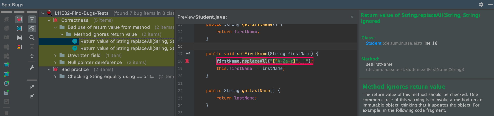

# Find Bugs

In this exercise, we want to find bugs by applying static analysis using [SpotBugs](https://spotbugs.github.io/).

## How to run SpotBugs

For this exercise, we recommend running the SpotBugs via your local IDE. However, you can also use the [SpotBugs GUI](https://spotbugs.readthedocs.io/en/stable/gui.html).

## Install the SpotBugs plugin for IntelliJ

Open the IntelliJ settings (File -> Settings or IntelliJ IDEA -> Settings) and navigate to the section `Plugins`. Open the tab `Marketplace` and search for `SpotBugs` and install the plugin. You may have to restart your IDE afterwards.

**Note:** Right after installing, IntelliJ may display the following error: `Do not request resource from classloader using path with leading slash`. You can simply ignore this error and it should not appear again.

## Run SpotBugs using IntelliJ

To execute the SpotBugs static code analysis, you have to perform the following steps:
1. Right click any project file (on the left hand side).
2. Navigate to `SpotBugs` -> `Analyze Project Files Not Including Test Files`. The project does not contain any tests, therefore we can simply use this option to skip the execution for test files. (You can also analyze individual files)
3. A toolwindow opens that displays the SpotBugs findings with a short description of the problem.

## Run SpotBugs using SpotBugs GUI

In comparison to the SpotBugs IDE plugin, the SpotBugs GUI does not execute the code analysis itself, but simply displays a priorly generated report. Therefore, you have to generate the report to use the results in the GUI.

This can be achieved by running `./gradlew clean spotbugsMain` from your preferred CLI (Command Line Interface). This command executes the SpotBugs code analysis for your main source code files (excluding test code) and generates a report file under the file path `build/spotbugs-report.xml`. Open this file in the SpotBugs GUI to see a graphical displaying of the findings.

## Your Task

The `SpotBugs Plugin/GUI` should display 7 bugs in 2 different categories:
- Correctness (5 -> 2,2,1)
- Bad practice (2)

Inspect the problems and navigate to the source code. Read the detailed error messages and think about a possible solution.

1. **Fix the found bugs**

    **Note:** The static code analysis features of Artemis are disabled for this exercise.