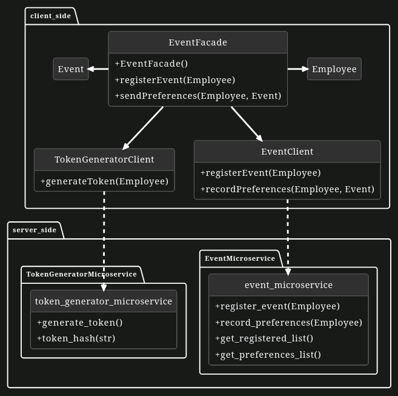

Bazel

Bazel is an open-source build and test tool developed by Google. It is designed to build and test software of any size, quickly and reliably. BUILD files contain rules that define how to build and test software components. Bazel excels in managing external dependencies, allowing you to easily integrate third-party libraries into your project using MODULE files. It is well-suited for projects that use multiple programming languages simultaneously by providing language-specific rules for building and testing each supported language. For example, java_binary for Java, cc_binary for C++, py_binary for Python, and so on. It also provides a unified build process that ensures consistency and correctness across different languages. Developers can focus on writing code while Bazel takes care of building and testing across language boundaries.
Background on Project Structure

As you have already seen in the MVC with Facade Pattern exercise, we can use a Facade to call the endpoints of various microservices.

In this exercise, we will reuse the same Facade structure, but with a slight twist:

The microservices have already been implemented in Python, and you will need to build these systems while paying close attention to strict dependency management.
UML Diagram of the client-side Facade Pattern and server-side Microservices:

client_sideserver_sideEventMicroserviceTokenGeneratorMicroserviceEventFacade+EventFacade()+registerEvent(Employee)+sendPreferences(Employee, Event)EmployeeEventTokenGeneratorClient+generateToken(Employee)EventClient+registerEvent(Employee)+recordPreferences(Employee, Event)event_microservice+register_event(Employee)+record_preferences(Employee)+get_registered_list()+get_preferences_list()token_generator_microservice+generate_token()+token_hash(str)

Note : The EventMicroservice and TokenGeneratorMicroservice are individual Flask apps and not classes (knowledge of Flask and its functionality are not necessary for this exercise). And the parameters of the register_event(Employee) and record_preferences(Employee, Event) functions in the EventMicroservice embody the POST body for the respective POST requests. Similarly the get_registered_list() & get_preferences_list() functions in the EventMicroservice represent GET requests.
Exercise

This exercise involves the development of a multilingual codebase where the client-side is implemented in Java, while the server-side is implemented in Python (Flask). The client-side features an EventFacade class, embodying the Facade pattern. This class calls to the EventMicroservice and TokenGeneratorMicroservice through the EventClient and TokenGeneratorClient respectively, enabling office staff to register for events.

This exercise will enhance your Bazel skills, to build the multilingual code with external dependencies.

Requirements:

    Bazelisk should be installed on your system.
    You should be familiar with Java and Python to understand the code.
    Exercise L08PB02 contains the prior knowledge to finish this exercise.

Note : When you first start the exercise, there will be dependencies that are not installed, but this is because you are supposed to install those external dependencies using Bazel.
General

    Implement the pip_parse rule in the MODULE file for Server side to install external dependencies from the respective requirements file. The target name should be pip_deps_server. Allocate the requirements_lock property of the pip_parse rule to the requirements file.

    Make sure .bazelrc includes common --enable_bzlmod and that a MODULE.bazel file exists at the root of the project.

server-side

Note
The BUILD.bazel file under server-side/ only includes the compile_pip_requirements rule used to generate the requirements_lock.txt.
All microservice targets are defined in their respective subdirectories.

Before building the project, you must generate the requirements_lock.txt file as follows:

    Step 1 – Create an empty file :

    touch server-side/requirements_lock.txt

    Step 2 – Generate the lock file using Bazel:

    bazel run //server-side:requirements.update

Once this is done, Bazel will be able to resolve Python dependencies using pip_parse in your MODULE.bazel file.

Building TokenGeneratorMicroservice No results
Implement the py_binary rule with the target name token_generator_microservice and specify the sources as well as the main file. Add requirements as a dependency as described here.

Note: While adding dependencies, don't use @{name}//{package} format, use the first described approach.

    Building EventMicroservice No results
    Analogous to TokenGeneratorMicroservice. The target name must be event_microservice.

client-side

    Implement the  File No results

    Part 1

    Implement the java_library rules in the BUILD file of client-side separately for the EventClient and TokenGeneratorClient with the target name event-client and token-generator-client respectively. Provide the necessary sources and the maven dependencies which have been installed in the Workspace file for each of them (e.g. @maven//:org_springframework_boot_spring_boot_starter_web)
    Part 2

    Implement the java_library rule in the BUILD file of client-side for the EventFacade with the target name event-facade by providing the necessary sources and dependencies (see UML diagram to find the dependencies).
    Part 3

    Implement the java_binary rule in the BUILD file of client-side with the target name client to bind the client-side completely. Provide the necessary sources and dependencies.
    Hint - Think about why we used the Facade Pattern
    Assign the main-class property of the java_binary with its respective location.

After successfully building the Project with Bazel, you can run the executable file generated by Bazel located in the bazel-bin directory using the following command: ./bazel-bin/target_name (e.g. './bazel-bin/client-side/client') The Makefile includes predefined shortcuts for running Bazel build targets more easily. Alternatively and more preferably, you can also run the executables using the Makefile with the following commands:

    make run_client
    make run_event_microservice
    make run_token_generator_microservice

Notes :

    In order to run the project and test its functionality, you must run each of the builds (Client, EventMicroservice, TokenGeneratorMicroservice) in individual terminal instances.

    If you get permission denied error while running executables, give the appropriate permissions to the directory.

